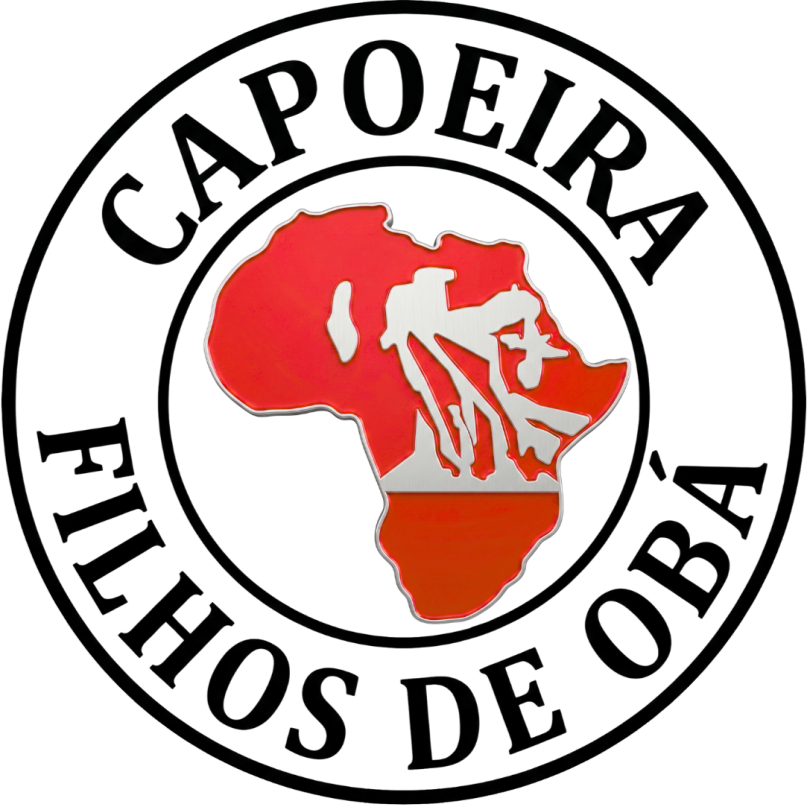

<div align="center">
  
  <h1>Centro Cultural Filhos de Obaluaiê</h1>
  <p><strong>Plataforma Digital e Acervo Memória — Tobias Barreto (SE)</strong></p>
</div>

> **Contexto Acadêmico:** Este projeto é fruto do **Projeto Integrador II** do curso de Bacharelado em Sistemas de Informação do **Instituto Federal de Sergipe (IFS) - Campus Lagarto**.  
> **Autores:** José Fabrício Santos Gregório e José Gustavo Correia Nascimento  
> **Orientador:** Prof. Danilo Ferreira Neves

---

## 🌿 Sobre o Projeto

Este repositório contém o código-fonte da plataforma digital oficial do **Centro Cultural Filhos de Obaluaiê**, um equipamento cultural e associação comunitária sem fins lucrativos localizado no Bairro Santa Rita, em Tobias Barreto (Sergipe).

O espaço é dedicado à promoção da cultura afro-brasileira, formação cultural e inclusão social de jovens e adolescentes da periferia, atuando desde 2005 sob a liderança do Mestre Bahia. O projeto abrange diversas linguagens:

- **Capoeira Contemporânea**
- **Musicalidade e Percussão**
- **Expressões Cênicas Tradicionais** (Dança Afro, Maculelê, Samba de Coco)

Esta plataforma foi concebida com um design **Mobile-First** premium, focado em alta acessibilidade para a comunidade local (maioria acessa via smartphone) e utiliza uma arquitetura moderna e escalável baseada em Headless CMS.

---

## 🚀 Tecnologias e Arquitetura

O projeto foi construído utilizando a stack moderna de React e infraestrutura serverless:

- **[Next.js (App Router)](https://nextjs.org/)** - Framework React para renderização híbrida (SSG/SSR) e roteamento de alta performance.
- **[Tailwind CSS (v4)](https://tailwindcss.com/)** - Estilização utilitária com design system fortemente customizado para as cores e identidade visual afro-brasileira.
- **[Sanity CMS](https://www.sanity.io/)** - Headless CMS configurado no diretório `/studio` para gestão autônoma de todo o conteúdo da plataforma (editais, eventos, galerias, notícias).
- **TypeScript** - Tipagem estática em toda a aplicação para segurança e manutenção a longo prazo.

---

## 🎨 Design System e UI/UX

A interface foi inteiramente pensada para refletir a herança afro-brasileira.
O design inclui tons terrosos, vermelhos de destaque (em homenagem a Obaluaiê), tipografia imponente e padrões visuais orgânicos (como máscaras SVG para imagens no desktop).

- **Cards Tipados:** Diferentes formatos visuais dependendo da natureza do conteúdo (ex: Rodas de Aniversariante recebem design mais festivo, Editais recebem design institucional).
- **Glassmorphism:** Uso estratégico de desfoque e transparência para criar profundidade e sofisticação sobre texturas de padrões Bogolan.
- **Micro-animações:** Transições suaves (`spring-transition`) e efeitos de *fade-up* garantem uma navegação viva e dinâmica.

---

## ⚙️ Como Executar Localmente

### Pré-requisitos

- Node.js (versão 18+ recomendada)
- NPM, Yarn, pnpm ou bun

### 1. Clonar e Instalar

```bash
git clone https://github.com/JGustavoCN/filhos-de-obaluaie.git
cd filhos-de-obaluaie
npm install
```

### 2. Rodar a Aplicação Web (Next.js)

```bash
npm run dev
```

Abra [http://localhost:3000](http://localhost:3000) no seu navegador.

### 3. Rodar o Sanity Studio (Painel de Gestão)

O painel administrativo do CMS está embarcado (ou em pasta separada). Para rodá-lo:

```bash
cd studio
npm install
npm run dev
```

O painel ficará disponível em `http://localhost:3333` (ou integrado na rota `/studio` caso configurado).

---

## 📚 Documentação Adicional

A pasta `/docs` contém toda a documentação de planejamento, requisitos, arquitetura visual e desenvolvimento que guiou a criação desta plataforma:

- [Documentos de Desenvolvimento (História e Requisitos)](./docs/Documentos%20de%20desenv.%20Centro%20Cultural%20Filhos%20de%20Obaluai%C3%AA.md)
- [Planejamento de Arquitetura Visual (Cards Tipados)](./docs/planejamento-cards-tipados.md)
- [Setup do Sanity MCP](./docs/sanity-mcp-setup.md)
- [Design System (Cores e Espaçamentos)](./DESIGN.md)

---

> *"O corpo fala, a alma canta, o pé risca a terra que nos sustenta."*
> — Filosofia do Centro Cultural Filhos de Obaluaiê
