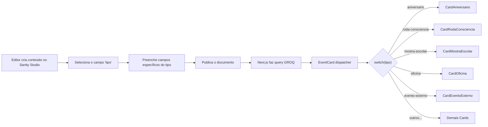

# Planejamento: Cards Tipados — Formatos Visuais por Tipo de Conteúdo

> **Projeto:** Centro Cultural Filhos de Obaluaiê  
> **Data:** 28/06/2026  
> **Design System:** [DESIGN.md](file:///c:/Projetos/react/filhos-de-obaluaie/DESIGN.md)  
> **Fonte de Dados:** [Documento de Desenvolvimento](file:///c:/Projetos/react/filhos-de-obaluaie/docs/Documentos%20de%20desenv.%20Centro%20Cultural%20Filhos%20de%20Obaluai%C3%AA.md)

---

## 1. Análise — Tipos de Conteúdo Identificados no Centro Cultural

A partir do documento de desenvolvimento, foram identificados **8 tipos distintos de conteúdo/evento** que o grupo produz e divulga. Cada tipo carrega uma identidade emocional, visual e funcional própria, o que justifica formatos visuais diferenciados.

### Mapa Completo de Tipos

| # | Tipo de Conteúdo | Natureza | Frequência | Público Principal | Emoção Central |
|---|---|---|---|---|---|
| 1 | **Roda de Aniversariantes** | Celebração comunitária | Mensal | Alunos + Famílias | Alegria, afeto, pertencimento |
| 2 | **Encontro Internacional da Consciência Negra** | Festival de grande porte | Anual (novembro) | Comunidade ampla + Convidados | Orgulho, resistência, ancestralidade |
| 3 | **Rodas da Consciência** | Oficina/intercâmbio | Anual (mês da Consciência Negra) | Capoeiristas + Comunidade | Aprendizado, troca, respeito |
| 4 | **Mostra Cultural para Escolas** | Culminância pedagógica | Anual | Escolas municipais + Alunos | Celebração, orgulho coletivo |
| 5 | **Aulas e Oficinas** (Capoeira / Percussão / Expressões Cênicas) | Atividade formativa permanente | Semanal | Crianças e adolescentes (6–14) | Disciplina, aprendizado, energia |
| 6 | **Participação em Eventos Externos** (Sarau "Tobias, sou Eu!", Semana Cultural etc.) | Representação / difusão | Pontual | Comunidade da cidade | Visibilidade, parceria |
| 7 | **Documentos Institucionais** (Editais, Relatórios, Estatuto) | Transparência / acervo | Sob demanda | Gestores, avaliadores, público | Confiança, transparência |
| 8 | **Notícias / Comunicados Gerais** | Informativo | Variável | Comunidade geral | Informação, engajamento |

---

## 2. Proposta — Formatos Visuais por Tipo (Card Variants)

A ideia central é: **cada tipo de conteúdo recebe um "traje" visual diferente**, como se cada card vestisse a roupa do seu evento. Todos os cards compartilham a mesma base do Design System (tipografia, paleta, glassmorphism, border-radius 12px), mas diferem em:

- **Cor de destaque / acento**
- **Ícone / elemento gráfico**
- **Layout interno (disposição de imagem, texto, metadados)**
- **Micro-animações no hover**
- **Bordas / frames decorativos**

### 2.1 🎂 Roda de Aniversariantes — `variant: "aniversario"`

**Conceito Visual:** Celebração, calor humano, festa em família.

| Propriedade | Valor |
|---|---|
| **Acento** | Amarelo Palha quente (`--color-secondary-hover: #EAE3D1`) com brilho dourado |
| **Ícone** | Bolo estilizado ou roda com velas (SVG customizado, traço orgânico) |
| **Frame** | Borda pontilhada dourada (`border: 2px dashed rgba(232, 197, 140, 0.65)`) — evoca bandeirinhas e festejo |
| **Layout** | Horizontal no desktop — imagem circular à esquerda (como se fosse uma "roda"), texto à direita |
| **Badge** | Tag "🎉 Aniversariantes do Mês" com fundo `--color-secondary` |
| **Hover** | Sutil confetti/sparkle animation (partículas CSS) + elevação suave |
| **Dados exibidos** | Mês de referência, nomes dos aniversariantes (opcional), data do evento, foto da roda |

**Mockup descritivo:**

```
┌─ ─ ─ ─ ─ ─ ─ ─ ─ ─ ─ ─ ─ ─ ─ ─ ─ ─ ─ ─ ─ ─ ─ ─┐
│  ┌──────────┐                                        │
│  │  🔵 IMG  │  🎉 Aniversariantes do Mês             │
│  │ (circle) │  ─────────────────────────              │
│  │          │  Julho 2026                             │
│  └──────────┘  Roda de capoeira, bolo e alegria...    │
│                                      📅 25/07/2026   │
└─ ─ ─ ─ ─ ─ ─ ─ ─ ─ ─ ─ ─ ─ ─ ─ ─ ─ ─ ─ ─ ─ ─ ─┘
```

---

### 2.2 ✊🏿 Encontro da Consciência Negra — `variant: "consciencia-negra"`

**Conceito Visual:** Monumentalidade, ancestralidade, poder. O maior evento do grupo merece o maior impacto visual.

| Propriedade | Valor |
|---|---|
| **Acento** | Vermelho Terra Cota intenso (`--color-primary: #9E1B1B`) |
| **Background** | `bg-[var(--color-surface)]` com border-radius `2xl` |
| **Frame** | Borda sutil `border-outline/20` com `overflow-hidden` |
| **Layout** | Card tipo "hero" — imagem grande em cima (aspect-ratio 16/9), texto embaixo |
| **Badge** | Número da edição em destaque ("XVIII Edição") sobreposta na foto com backdrop-blur |
| **Ícone** | N/A (hero image foca na foto principal) |
| **Hover** | `spring-transition` com `hover:-translate-y-2` e `hover:shadow-xl` |
| **Dados exibidos** | Edição (nº), data, local, descrição, galeria de fotos |

**Mockup descritivo:**

```
╔══════════════════════════════════════╗
║  ┌──────────────────────────────┐    ║
║  │                              │    ║
║  │       IMAGEM HERO 16:9      │    ║
║  │                              │    ║
║  └──────────────────────────────┘    ║
║                                      ║
║  ✊🏿 XVII EDIÇÃO                     ║
║  ══════════════════                  ║
║  Encontro Internacional da           ║
║  Consciência Negra                   ║
║                                      ║
║  Novembro 2024 · Tobias Barreto     ║
╚══════════════════════════════════════╝
```

---

### 2.3 🥋 Rodas da Consciência — `variant: "roda-consciencia"`

**Conceito Visual:** Intercâmbio, sabedoria, roda aberta. O mestre convidado é o protagonista.

| Propriedade | Valor |
|---|---|
| **Acento** | Barro terroso (`--color-outline: #8A7470`) — sobriedade de mestre |
| **Background** | Glassmorphism padrão (`glass-card`) |
| **Layout** | Card com avatar grande do mestre convidado (se houver) + citação ou tema da roda |
| **Badge** | "Roda da Consciência" + nome do mestre convidado |
| **Ícone** | Berimbau estilizado (SVG) |
| **Borda** | Borda esquerda grossa (`border-left: 4px solid --color-primary`) — estilo "citação" |
| **Hover** | Transição suave spring-transition + borda muda para `--color-primary-hover` |
| **Dados exibidos** | Mestre convidado, tema, data, local, se é aberta ao público |

**Mockup descritivo:**

```
┌────────────────────────────────────────┐
│ ▌  ┌────────┐                          │
│ ▌  │ 🧔🏿 IMG │  Mestre Zezinho         │
│ ▌  │ avatar │  (Convidado)             │
│ ▌  └────────┘                          │
│ ▌                                      │
│ ▌  "Roda da Consciência"               │
│ ▌  A ancestralidade no jogo de Angola  │
│ ▌                                      │
│ ▌  📅 15/11/2026 · Aberto ao público   │
└────────────────────────────────────────┘
```

---

### 2.4 🎭 Mostra Cultural para Escolas — `variant: "mostra-escolar"`

**Conceito Visual:** Colorido, jovem, energia coletiva. Muitos participantes, muitas apresentações.

| Propriedade | Valor |
|---|---|
| **Acento** | Paleta intercalada (primary/secondary) — alternância visual que evoca "diversidade" |
| **Background** | Card com sutil pattern Bogolan (classe `.bogolan-pattern` já existente) na opacidade mínima |
| **Layout** | Grid de mini-fotos (3–4 thumbnails) em mosaico + título grande |
| **Badge** | Escolas participantes listadas como tags pill |
| **Ícone** | Máscara teatral ou roda com crianças (SVG) |
| **Hover** | Thumbnails fazem scale(1.05) em stagger |
| **Dados exibidos** | Nome da mostra, escolas participantes, data, local, quantidade de alunos, fotos em mosaico |

**Mockup descritivo:**

```
┌──────────────────────────────────────┐
│  Mostra Cultural 2026                │
│  ════════════════════                │
│  ┌─────┐ ┌─────┐ ┌─────┐           │
│  │ 📷1 │ │ 📷2 │ │ 📷3 │           │
│  └─────┘ └─────┘ └─────┘           │
│                                      │
│  [Iraildes] [Telma] [Nicodemos]     │
│                                      │
│  120 alunos · 15/12/2026            │
└──────────────────────────────────────┘
```

---

### 2.5 🥁 Oficinas / Aulas Permanentes — `variant: "oficina"`

**Conceito Visual:** Formação, ritmo, disciplina. Cada modalidade (capoeira, percussão, dança) pode ter sub-variante visual.

| Propriedade | Valor |
|---|---|
| **Acento** | Depende da modalidade — mapeamento sugerido abaixo |
| **Background** | Card com frame `card-9slice` ou `card-9slice-secondary` (já existente) |
| **Layout** | O card já existente em `ProjectsSection.tsx` serve como base — adaptar para receber dados dinâmicos do Sanity |
| **Sub-variantes** | `capoeira` → frame primary, `percussao` → frame secondary, `danca-teatro` → frame primary |
| **Ícone** | Ícones por modalidade (já existem: `icon-capoeira.png`, `icon-atabaque.png`) |
| **Hover** | Spring-transition existente |
| **Dados exibidos** | Nome da oficina, descrição, horários, oficineiro responsável, faixa etária |

> **Nota:** Este é o tipo mais próximo do que já existe. A principal mudança é torná-lo dinâmico (vindo do Sanity) e associar o `frame` à modalidade.

---

### 2.6 📡 Participação em Eventos Externos — `variant: "evento-externo"`

**Conceito Visual:** Parceria, rede, presença na cidade. O centro "saindo para o mundo".

| Propriedade | Valor |
|---|---|
| **Acento** | `--color-tertiary` (carvão) — sóbrio, institucional |
| **Background** | Glassmorphism padrão, sem frame decorativo |
| **Layout** | Card compacto, horizontal — ícone de localização + nome do evento + data |
| **Badge** | "Participação" com pill em `--color-tertiary-container` |
| **Ícone** | Pin de localização ou rede/nodes (SVG) |
| **Hover** | Borda muda sutilmente + ícone ganha cor primary |
| **Dados exibidos** | Nome do evento, organizador, data, local, tipo de participação |

**Mockup descritivo:**

```
┌──────────────────────────────────────┐
│  📍  Sarau "Tobias, sou Eu!"        │
│      ─────────────────────           │
│      Coletivo Cultural               │
│      Participação: Apresentação      │
│                                      │
│      📅 10/08/2026 · Praça Central   │
│                           [Parceria] │
└──────────────────────────────────────┘
```

---

### 2.7 📄 Documentos Institucionais — `variant: "documento"` (já existe parcialmente)

**Conceito Visual:** Transparência, seriedade, confiança. Limpo e funcional.

| Propriedade | Valor |
|---|---|
| **Layout** | O `ArchiveSection.tsx` já define esse formato — lista horizontal com ícone de arquivo |
| **Mudança** | Tornar dinâmico (Sanity), adicionar categorias (edital, relatório, estatuto) com badges coloridos |
| **Badge por subtipo** | Edital → `--color-primary`, Relatório → `--color-outline`, Estatuto → `--color-tertiary` |
| **Dados exibidos** | Título, tipo, tamanho, data, link para download |

---

### 2.8 📰 Notícias / Comunicados — `variant: "noticia"`

**Conceito Visual:** Informativo, acessível, leve. O "feed" do centro.

| Propriedade | Valor |
|---|---|
| **Acento** | Primary sutil (hover apenas) |
| **Background** | Glassmorphism leve |
| **Layout** | Card vertical — imagem em cima (aspect-ratio 4/3), título, resumo, data |
| **Badge** | Categoria da notícia (Comunicado, Convite, Registro) |
| **Hover** | Imagem faz scale(1.03) + título muda para `--color-primary` |
| **Dados exibidos** | Título, resumo, imagem de capa, data de publicação, categoria |

**Mockup descritivo:**

```
┌──────────────────────┐
│  ┌──────────────────┐│
│  │                  ││
│  │   IMAGEM 4:3     ││
│  │                  ││
│  └──────────────────┘│
│                      │
│  [Comunicado]        │
│  Inscrições abertas  │
│  para turma 2026     │
│                      │
│  As inscrições para  │
│  as oficinas de...   │
│                      │
│  📅 02/03/2026       │
└──────────────────────┘
```

---

## 3. Arquitetura de Dados — Schema Sanity

O schema atual (`post.ts`) é genérico demais. A proposta é substituí-lo por um modelo que suporte a tipagem visual. Existem duas abordagens:

### Opção A: Campo `tipo` como enum (Recomendada)

Um único document type `evento` com um campo `tipo` que determina o formato visual.

```
Documento: evento
├── title (string)
├── slug (slug)
├── tipo (string, list) ← "aniversario" | "consciencia-negra" | "roda-consciencia" | "mostra-escolar" | "oficina" | "evento-externo" | "noticia"
├── subtipo (string, list, condicional) ← para oficinas: "capoeira" | "percussao" | "danca-teatro"
├── resumo (text)
├── body (portable text)
├── imagemCapa (image)
├── galeria (array of image)
├── dataEvento (datetime)
├── dataFim (datetime, opcional)
├── local (string)
├── edicao (number, opcional) ← para Consciência Negra
├── mestreConvidado (string, opcional) ← para Rodas da Consciência
├── escolasParticipantes (array of string, opcional) ← para Mostra Escolar
├── oficineiro (string, opcional) ← para Oficinas
├── faixaEtaria (string, opcional)
├── aniversariantes (array of string, opcional) ← para Roda de Aniversariantes
└── arquivo (file, opcional) ← para Documentos
```

**Vantagens:** Simplicidade, único content type, fácil de filtrar com GROQ.  
**Desvantagens:** Muitos campos condicionais que "poluem" o Studio.

### Opção B: Document types separados

Cada tipo de conteúdo vira um document type Sanity independente.

```
Documents:
├── rodaAniversariantes
├── encontroConscienciaNegra
├── rodaConsciencia
├── mostraCultural
├── oficina
├── eventoExterno
├── documento
└── noticia
```

**Vantagens:** Schema limpo, fields específicos por tipo, Studio organizado.  
**Desvantagens:** Mais arquivos de schema, consultas GROQ mais complexas para listagens mistas.

### Opção C: Híbrida (Ideal para este projeto)

Agrupar em 3 document types por "família", usando o campo `tipo` para sub-variantes:

```
Documents:
├── evento (tipo: "aniversario" | "consciencia-negra" | "roda-consciencia" | "mostra-escolar" | "evento-externo")
├── oficina (subtipo: "capoeira" | "percussao" | "danca-teatro")
├── publicacao (tipo: "noticia" | "documento")
```

> [!IMPORTANT]
> **Decisão (29/06/2026): Aprovada a OPÇÃO B (Document Types Separados).**
> **Motivo:** O projeto frontend evoluiu e exigiu muitos campos únicos para cada formato (ex: `aniversariantes` só para Aniversário, `escolasParticipantes` só para Mostra, `mestreConvidado` só para Roda). Forçar a Opção C (Híbrida) resultaria em um schema "monolítico" cheio de campos condicionais ocultos no Sanity (`hidden: () => ...`), prejudicando a UX dos editores. Com a Opção B, o Sanity espelha perfeitamente a tipagem estrita do Frontend, e cada formulário no Painel carrega exclusivamente os dados que o Card precisa.

---

## 4. Renderização Condicional — Frontend (Next.js)

A lógica no frontend segue o padrão de **"adapter visual"**: um componente wrapper que recebe os dados do Sanity e despacha para o componente de card correto.

### 4.1 Componente Dispatcher

```tsx
// Pseudocódigo ilustrativo do Dispatcher

function EventCard({ evento }) {
  switch (evento.tipo) {
    case "aniversario":
      return <CardAniversario data={evento} />
    case "consciencia-negra":
      return <CardConscienciaNegra data={evento} />
    case "roda-consciencia":
      return <CardRodaConsciencia data={evento} />
    case "mostra-escolar":
      return <CardMostraEscolar data={evento} />
    case "oficina":
      return <CardOficina data={evento} />
    case "evento-externo":
      return <CardEventoExterno data={evento} />
    case "documento":
      return <CardDocumento data={evento} />
    case "noticia":
    default:
      return <CardNoticia data={evento} />
  }
}
```

### 4.2 Arquitetura Visual por Variante

Cada variante adota padrões específicos de layout em conjunto com as abstrações globais do Tailwind (`.badge-tipo`, etc):

| Variante | Classes Base | Composição e Modificadores |
|---|---|---|
| `aniversario` | `glass-card` | Gradiente animado `.animate-gradient-festivo`, marca d'água grande de bolo e scroll `.custom-scrollbar` para os nomes. |
| `consciencia-negra` | `card-9slice` | Fundo `bg-[var(--color-tertiary)]`, texto `text-on-primary`. |
| `roda-consciencia` | `glass-card` | Borda lateral forte `border-l-[6px]`, Avatar arredondado (`rounded-3xl`) à esquerda e marca d'água de Berimbau. |
| `mostra-escolar` | `glass-card bogolan-pattern` | Grid de thumbnails arredondados que fazem scale no hover e fundo étnico suave. |
| `oficina` | `card-9slice` / `card-9slice-secondary` | Frame visual com SVG decorativo em posições absolutas nos cantos. |
| `evento-externo` | `glass-card` | Layout horizontal (`flex-row`), padding generoso e ícone circular escalável à esquerda. |
| `documento` | `glass-card` | Ícone grande e layout direto de acesso ao documento. |
| `noticia` | `glass-card` | Card vertical padrão, leitura limpa (`text-balance`). |

---

## 5. Fluxo Completo — Do Sanity ao Card



---


## 6. Resumo Visual — Identidade de Cada Card

| Tipo | Emoji | Cor Dominante | Elemento Marcante | Sensação |
|---|---|---|---|---|
| Aniversário | 🎂 | Dourado/Palha | Gradiente animado, bolo gigante | Festa, calor |
| Consciência Negra | ✊🏿 | Vermelho + Carvão | Frame 9-slice, fundo escuro, nº edição | Poder, ancestralidade |
| Roda da Consciência | 🥋 | Barro terroso | Avatar arredondado à esquerda, Berimbau | Sabedoria, troca |
| Mostra Escolar | 🎭 | Multicor intercalado | Mosaico de fotos que pulam | Energia jovem |
| Oficina | 🥁 | Primary/Secondary | Frame 9-slice | Ritmo, formação |
| Evento Externo | 📡 | Carvão | Compacto horizontal, pad generoso | Rede, parceria |
| Documento | 📄 | Neutro | Lista horizontal, ícone de arquivo | Transparência |
| Notícia | 📰 | Sutil | Card vertical, imagem 4:3 | Informação leve |

---

## 7. Boas Práticas e Guidelines de Implementação

### 7.1 Composição Espacial e Hierarquia Visual
A forma como as imagens de capa (`imagemCapa`) são renderizadas deve ser decidida com base na densidade de conteúdo do card, já que todos usam `h-full` no grid:
- **Hero Image (Topo):** Usar um bloco largo (`w-full h-48`) no topo do card quando o conteúdo for curto (ex: *Mostra Escolar*, *Roda da Consciência* sem muita descrição). Isso evita o "vazio" central e estica visualmente o card de forma atraente (estilo poster).
- **Avatar de Perfil (Lado Esquerdo):** Usar bloco arredondado à esquerda (ex: `w-32 h-32 rounded-3xl`) quando a imagem for um rosto (Mestre) ou a informação do título for pesada e precisar dividir espaço lateralmente. Impede o corte de rostos ("fatiar a testa") comum em Hero Images horizontais.
- **Watermarks no Fundo:** Ícones gigantes (`w-56 h-56`) em posição absolute no canto inferior direito com baixíssima opacidade (5-20%) ajudam a reforçar a temática sem adicionar ruído textual.

### 7.2 Desacoplamento e CSS Global (Utilities)
Para manter o DRY (Don't Repeat Yourself), abstraímos componentes comuns da UI para classes utilitárias no `globals.css` (camada `@layer components`):
- **`.badge-tipo`**: Classe base para as "pílulas" de categoria.
  - Variações: `.badge-primary`, `.badge-secondary`, `.badge-surface`.
- **Metadados**: `.meta-date` e `.meta-tag` para formatar os rodapés (calendário e badges de 'Aberto').
- **Animações e Scroll**: 
  - `.animate-gradient-festivo` para fundos vibrantes (ex: Aniversário).
  - `.custom-scrollbar` para permitir o scroll de longas listas (ex: lista de aniversariantes) sem invadir o visual do card.

### 7.3 Acessibilidade Visual (Glassmorphism e Dark Mode)
- **Modo Claro vs Escuro:** Transparências (opacidades) usadas em elementos de fundo (`bg-` ou ícones absolutos) devem ser ajustadas dinamicamente (`opacity-30 dark:opacity-15`). No modo Ancestral, as cores de opacidade devem ser leves para não cobrir o sombreamento (Inner Glow) nativo do `glass-card`.
- **Contraste:** Ícones de fundo escuros no Light Mode devem ser testados contra visibilidade no Dark Mode (frequentemente usando `--color-primary` que mantém o peso, ou forçando um outline claro).
- **Sem Emojis:** Todos os sentimentos e temáticas devem ser representados via ícones SVG (`CakeIcon`, `PartyIcon`, `BerimbauIcon`) com cores baseadas no Design System. Uso de emojis (`✨`, `🎉`) é expressamente proibido para manter o tom profissional/cultural.

---

## 8. Considerações do Design System

Todas as variantes **respeitam rigorosamente** o [DESIGN.md](file:///c:/Projetos/react/filhos-de-obaluaie/DESIGN.md):

- ✅ Nenhuma cor nova fora da paleta (zero cores novas)
- ✅ Tipografia Syne (headlines) + DM Sans (body/labels)
- ✅ Border-radius: 12px (cards) e 9999px (pills/botões)
- ✅ Glassmorphism com blur(12px) e opacidade controlada
- ✅ Transições com curva spring (ease orgânico)
- ✅ Contraste WCAG AA/AAA mantido em todas as combinações
- ✅ Compatibilidade com Modo Ancestral (dark mode)
- ✅ Uso semântico de variáveis CSS (`var(--color-*)`)
- ✅ Layout inspirado no "Grid Africano" com espaçamento generoso
